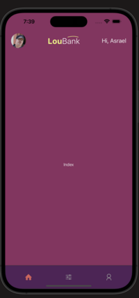

# Welcome to react native tutorial

## Get started

### Dependencies

```json
"dependencies": {
  "@expo/vector-icons": "^14.0.2",
  "@react-navigation/native": "^6.0.2",
  "expo": "~51.0.28",
  "expo-constants": "~16.0.2",
  "expo-font": "~12.0.9",
  "expo-linking": "~6.3.1",
  "expo-router": "~3.5.23",
  "expo-splash-screen": "~0.27.5",
  "expo-status-bar": "~1.12.1",
  "expo-system-ui": "~3.0.7",
  "expo-web-browser": "~13.0.3",
  "react": "18.2.0",
  "react-dom": "18.2.0",
  "react-native": "0.74.5",
  "react-native-gesture-handler": "~2.16.1",
  "react-native-reanimated": "~3.10.1",
  "react-native-safe-area-context": "4.10.5",
  "react-native-screens": "3.31.1",
  "react-native-svg": "^15.6.0",
  "react-native-web": "~0.19.10"
}
```


# This is what we will build 

## Step by step:

[Visita el sitio de React Native](https://citrine-croissant-fff.notion.site/React-Native-5a3ee164ecef462eb74604b470657749h)

 


 